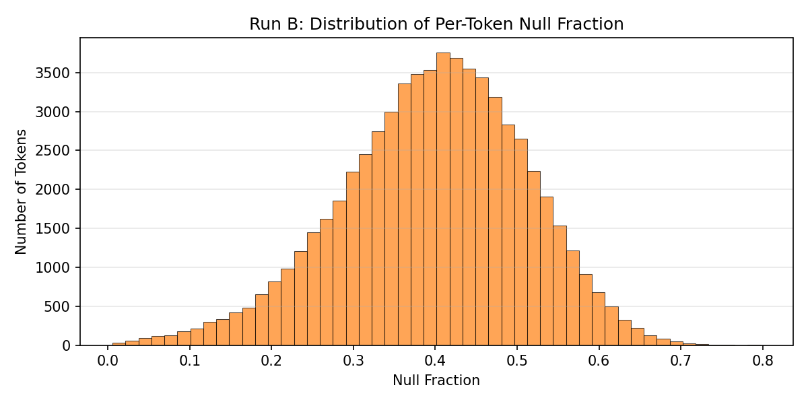
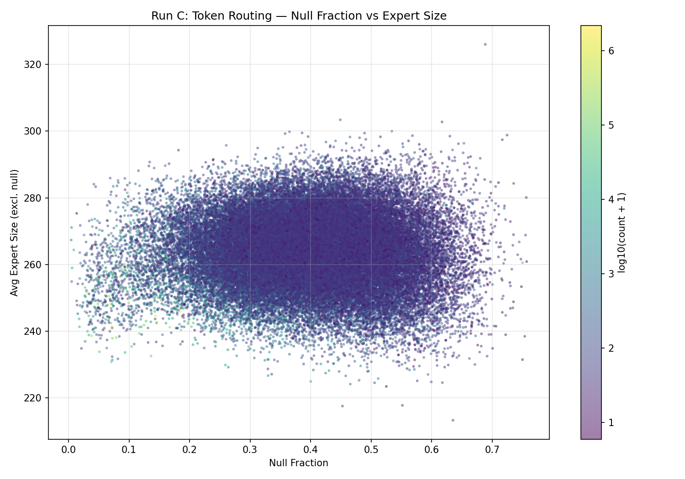
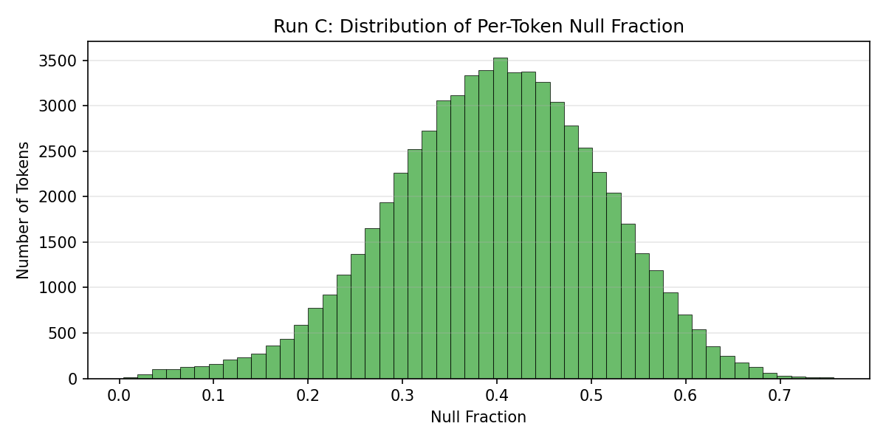
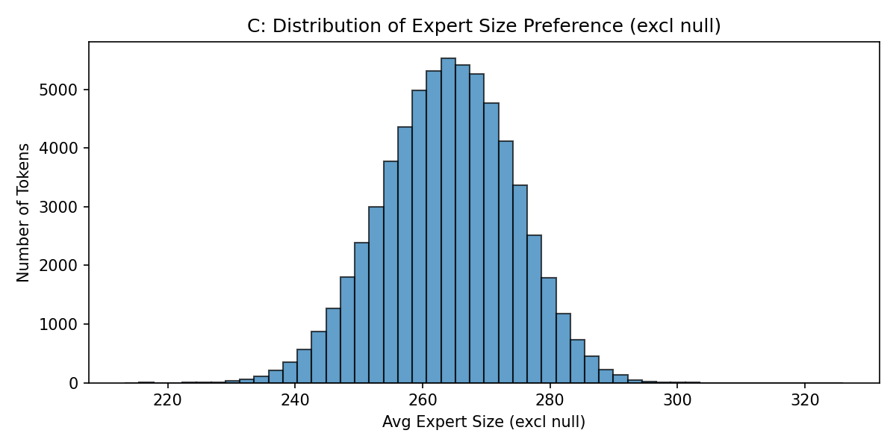
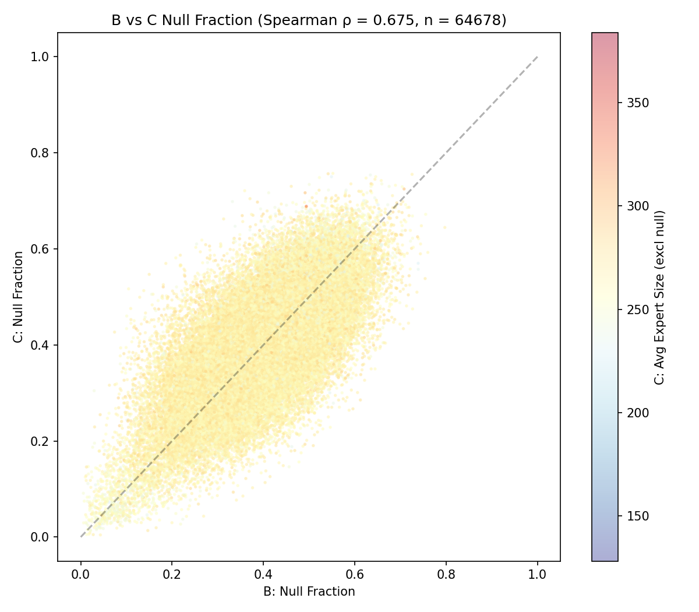

# Round 2: Token-Level Routing Analysis

## Setup

- Evaluation: 3200 batches x 16 sequences x 1024 tokens = 52,428,800 token positions
- Minimum token count for inclusion: 5
- Routing: sigmoid + top-8, weights renormalized after null zeroing
- Expert width lookup: null=0, sizes per run config
- **Note**: Routing analysis uses v2 checkpoints (~1.08 bpb). Training curves use v1 runs (~1.03 bpb).

---
## Run B: B: 48 uniform + 16 null

**64678 unique tokens** (min count >= 5)

| Statistic | Null Fraction | Avg Expert Size (incl null) | Avg Expert Size (excl null) |
|-----------|--------------|---------------------------|----------------------------|
| Mean | 0.3975 | 154.2 | 256.0 |
| Median | 0.4040 | 152.6 | 256.0 |
| Std | 0.1128 | 28.9 | 0.0 |
| Min | 0.0058 | 51.9 | 256.0 |
| Max | 0.7972 | 254.5 | 256.0 |

### Null Fraction Distribution

### Top 20 Tokens by Compute (highest avg expert size incl null)

| Token | ID | Count | Null Frac | Avg Size (incl null) | Avg Size (excl null) |
|-------|-----|-------|-----------|---------------------|---------------------|
| `:¦\n` | 47421 | 72 | 0.0058 | 255 | 256 |
| ` -\n` | 19425 | 346 | 0.0064 | 254 | 256 |
| `%¦\n` | 32637 | 86 | 0.0078 | 254 | 256 |
| `At` | 3291 | 4023 | 0.0100 | 253 | 256 |
| `_and` | 63583 | 48 | 0.0106 | 253 | 256 |
| `\n` | 10 | 292059 | 0.0115 | 253 | 256 |
| `In` | 20165 | 252 | 0.0117 | 253 | 256 |
| `Between` | 18196 | 313 | 0.0119 | 253 | 256 |
| `“In` | 15356 | 388 | 0.0125 | 253 | 256 |
| ` “[` | 25613 | 174 | 0.0126 | 253 | 256 |
| ` –\n` | 18716 | 352 | 0.0129 | 253 | 256 |
| `<comma>\n` | 2172 | 10045 | 0.0134 | 253 | 256 |
| ` In` | 515 | 60571 | 0.0141 | 252 | 256 |
| `“There` | 16237 | 377 | 0.0147 | 252 | 256 |
| ` --\n` | 61108 | 59 | 0.0148 | 252 | 256 |
| `).¦\n` | 36720 | 105 | 0.0157 | 252 | 256 |
| ` At` | 1531 | 8578 | 0.0164 | 252 | 256 |
| `)<comma>\n` | 20427 | 304 | 0.0168 | 252 | 256 |
| `))\n` | 45180 | 111 | 0.0168 | 252 | 256 |
| `We` | 1569 | 10074 | 0.0177 | 251 | 256 |

### Bottom 20 Tokens by Compute (lowest avg expert size incl null)

| Token | ID | Count | Null Frac | Avg Size (incl null) | Avg Size (excl null) |
|-------|-----|-------|-----------|---------------------|---------------------|
| `otrophs` | 58610 | 30 | 0.7972 | 52 | 256 |
| `awatts` | 24878 | 24 | 0.7600 | 61 | 256 |
| `ochromatic` | 50337 | 8 | 0.7552 | 63 | 256 |
| `abian` | 54206 | 69 | 0.7541 | 63 | 256 |
| ` gluconate` | 64856 | 5 | 0.7458 | 65 | 256 |
| `す` | 61640 | 58 | 0.7441 | 66 | 256 |
| `otomy` | 28202 | 117 | 0.7437 | 66 | 256 |
| `wd` | 46489 | 56 | 0.7396 | 67 | 256 |
| `hoot` | 60933 | 18 | 0.7390 | 67 | 256 |
| ` faulkner` | 57912 | 14 | 0.7388 | 67 | 256 |
| ` NADH` | 54900 | 24 | 0.7374 | 67 | 256 |
| `therapy` | 42757 | 107 | 0.7361 | 68 | 256 |
| ` microgreens` | 55152 | 10 | 0.7281 | 70 | 256 |
| `ipheral` | 32833 | 12 | 0.7266 | 70 | 256 |
| `uterol` | 53163 | 38 | 0.7264 | 70 | 256 |
| `ERING` | 65264 | 25 | 0.7262 | 70 | 256 |
| `elsius` | 14544 | 31 | 0.7255 | 70 | 256 |
| `aaS` | 49824 | 45 | 0.7243 | 71 | 256 |
| `ranchise` | 26438 | 22 | 0.7221 | 71 | 256 |
| `ocide` | 13769 | 36 | 0.7216 | 71 | 256 |

### Token Frequency vs Null Routing

| Frequency Bin | # Tokens | Mean Null Frac | Mean Avg Size (incl null) |
|--------------|----------|---------------|--------------------------|
| <100 | 33247 | 0.4149 | 150 |
| 100-1k | 26131 | 0.3898 | 156 |
| 1k-10k | 4792 | 0.3358 | 170 |
| 10k-100k | 462 | 0.2448 | 193 |
| >100k | 46 | 0.1478 | 218 |

---
## Run C: C: 24 large + 24 small + 16 null

**64678 unique tokens** (min count >= 5)

| Statistic | Null Fraction | Avg Expert Size (incl null) | Avg Expert Size (excl null) |
|-----------|--------------|---------------------------|----------------------------|
| Mean | 0.3982 | 158.9 | 263.9 |
| Median | 0.4015 | 158.4 | 264.2 |
| Std | 0.1120 | 30.2 | 10.2 |
| Min | 0.0044 | 57.9 | 213.3 |
| Max | 0.7569 | 272.2 | 326.0 |

### Null Fraction vs Expert Size

### Null Fraction Distribution

### Top 20 Tokens by Compute (highest avg expert size incl null)

| Token | ID | Count | Null Frac | Avg Size (incl null) | Avg Size (excl null) |
|-------|-----|-------|-----------|---------------------|---------------------|
| `Our` | 28144 | 164 | 0.0419 | 272 | 284 |
| `�` | 48322 | 10 | 0.0135 | 272 | 275 |
| `People` | 45696 | 49 | 0.0449 | 271 | 283 |
| `“We` | 7285 | 1320 | 0.0050 | 270 | 271 |
| ` Tel` | 16376 | 464 | 0.0317 | 269 | 278 |
| `Whilst` | 31694 | 125 | 0.0193 | 266 | 272 |
| `“My` | 33744 | 116 | 0.0689 | 266 | 286 |
| `We` | 9758 | 803 | 0.0044 | 266 | 267 |
| `Heb` | 30432 | 104 | 0.0342 | 264 | 273 |
| `Our` | 4451 | 2444 | 0.0385 | 263 | 273 |
| ` Researchers` | 9315 | 855 | 0.0739 | 262 | 283 |
| ` We` | 1009 | 19899 | 0.0087 | 262 | 264 |
| ` Such` | 6124 | 2222 | 0.0257 | 262 | 269 |
| `“An` | 58405 | 48 | 0.0705 | 262 | 282 |
| `-called` | 7901 | 1430 | 0.0818 | 262 | 285 |
| ` Our` | 3607 | 4066 | 0.0434 | 262 | 274 |
| ` vs` | 7108 | 1763 | 0.0698 | 261 | 281 |
| `Nevertheless` | 25561 | 232 | 0.0823 | 261 | 285 |
| `“Our` | 20805 | 246 | 0.0802 | 261 | 284 |
| `Your` | 6289 | 1695 | 0.0395 | 261 | 271 |

### Bottom 20 Tokens by Compute (lowest avg expert size incl null)

| Token | ID | Count | Null Frac | Avg Size (incl null) | Avg Size (excl null) |
|-------|-----|-------|-----------|---------------------|---------------------|
| `ranath` | 49996 | 10 | 0.7500 | 58 | 231 |
| `escens` | 63274 | 25 | 0.7538 | 59 | 238 |
| `rossover` | 43944 | 9 | 0.7569 | 63 | 261 |
| `relia` | 55759 | 6 | 0.7483 | 64 | 253 |
| `<¦bos¦>` | 65527 | 53411 | 0.7501 | 65 | 261 |
| `olam` | 51684 | 30 | 0.7340 | 66 | 247 |
| `elsius` | 14544 | 31 | 0.7550 | 66 | 269 |
| `aguar` | 32275 | 7 | 0.7351 | 66 | 249 |
| `₂` | 34135 | 32 | 0.7474 | 66 | 262 |
| `reland` | 6318 | 9 | 0.7222 | 66 | 239 |
| `racycline` | 52328 | 28 | 0.7299 | 67 | 247 |
| `/mL` | 46038 | 62 | 0.7421 | 68 | 263 |
| `́` | 48320 | 121 | 0.7223 | 68 | 245 |
| `ì` | 41283 | 150 | 0.7447 | 68 | 267 |
| `zheimer` | 7071 | 10 | 0.7562 | 68 | 280 |
| ` methionine` | 61071 | 45 | 0.7301 | 68 | 254 |
| `ysuckle` | 54245 | 7 | 0.7292 | 69 | 255 |
| `ethane` | 33740 | 100 | 0.7323 | 69 | 259 |
| `rietta` | 44085 | 10 | 0.7167 | 70 | 246 |
| `clockwise` | 46620 | 8 | 0.7005 | 70 | 235 |

### Token Frequency vs Null Routing

| Frequency Bin | # Tokens | Mean Null Frac | Mean Avg Size (incl null) |
|--------------|----------|---------------|--------------------------|
| <100 | 33247 | 0.4175 | 154 |
| 100-1k | 26131 | 0.3887 | 161 |
| 1k-10k | 4792 | 0.3328 | 174 |
| 10k-100k | 462 | 0.2460 | 194 |
| >100k | 46 | 0.1493 | 214 |

### Top 20 Tokens by Avg Expert Size excl null (most compute)

| Token | ID | Count | Null Frac | Avg Size (incl null) | Avg Size (excl null) |
|-------|-----|-------|-----------|---------------------|---------------------|
| `/month` | 55321 | 31 | 0.6885 | 102 | 326 |
| ` Plasmodium` | 49412 | 108 | 0.4490 | 167 | 303 |
| `-pocket` | 56395 | 33 | 0.6171 | 116 | 303 |
| ` Endangered` | 18216 | 283 | 0.5342 | 140 | 300 |
| ` Wed` | 9451 | 166 | 0.3651 | 190 | 300 |
| ` Aero` | 56637 | 60 | 0.3859 | 184 | 299 |
| ` Edible` | 59151 | 43 | 0.4891 | 153 | 299 |
| `Wildlife` | 40036 | 76 | 0.3579 | 192 | 299 |
| `.exe` | 46471 | 25 | 0.7246 | 82 | 299 |
| `lbs` | 53867 | 57 | 0.5682 | 129 | 299 |
| `zheimers` | 58615 | 37 | 0.6301 | 110 | 298 |
| ` DISE` | 56017 | 37 | 0.3958 | 180 | 298 |
| `astronomy` | 54717 | 19 | 0.5154 | 145 | 298 |
| ` binge` | 22182 | 258 | 0.4650 | 160 | 298 |
| ` Marijuana` | 44371 | 77 | 0.4809 | 155 | 298 |
| ` undercooked` | 57332 | 46 | 0.4912 | 151 | 298 |
| `mittent` | 48925 | 25 | 0.7167 | 84 | 297 |
| `lades` | 12338 | 14 | 0.5618 | 130 | 297 |
| ` AIDS` | 11131 | 866 | 0.4412 | 166 | 297 |
| ` Gaelic` | 30445 | 162 | 0.4253 | 171 | 297 |

### Expert Size Distribution (excl null)

---
## Cross-Run Comparison: Flagged Tokens

| Token | B Null Frac | C Null Frac | B Avg Size (incl null) | C Avg Size (incl null) |
|-------|------------|------------|----------------------|----------------------|
| ! | 0.1400 | 0.1074 | 220 | 229 |
| , | 0.1215 | 0.0714 | 225 | 224 |
| . | 0.1454 | 0.1439 | 219 | 209 |
| : | 0.0623 | 0.0425 | 240 | 237 |
| ; | 0.0559 | 0.0510 | 242 | 222 |
| ? | 0.0865 | 0.0502 | 234 | 243 |
| BOS | 0.6459 | 0.7501 | 91 | 65 |
| a | 0.0874 | 0.0855 | 234 | 234 |
| and | 0.1736 | 0.1842 | 212 | 201 |
| class | 0.3172 | 0.3757 | 175 | 158 |
| def | 0.2264 | 0.3321 | 198 | 184 |
| else | 0.4234 | 0.4508 | 148 | 144 |
| for | 0.2516 | 0.2833 | 192 | 194 |
| function | 0.3110 | 0.3910 | 176 | 152 |
| if | 0.2056 | 0.1789 | 203 | 203 |
| import | 0.3477 | 0.3566 | 167 | 165 |
| in | 0.1298 | 0.2071 | 223 | 208 |
| is | 0.0677 | 0.0674 | 239 | 234 |
| it | 0.1497 | 0.0788 | 218 | 219 |
| of | 0.2928 | 0.3123 | 181 | 189 |
| return | 0.3684 | 0.4101 | 162 | 153 |
| that | 0.0920 | 0.1674 | 232 | 201 |
| the | 0.1243 | 0.0699 | 224 | 231 |
| to | 0.2620 | 0.2823 | 189 | 186 |

### B vs C Null Fraction Correlation

**Spearman ρ = 0.675** across 64678 shared tokens.
Color = C's avg expert size (excl null). Tokens below the diagonal are less null-routed in C than B; blue (small expert) below the diagonal = tokens where C substitutes small experts for null routing.

### Null Routing vs Reduced Compute

Tokens bucketed by B's null fraction. For each bucket, what does C do with the same tokens?

| B Null Frac Bucket | # Tokens | B Mean Null Frac | C Mean Null Frac | C Mean Size (excl null) | C Mean Size (incl null) |
|-------------------|----------|-----------------|-----------------|------------------------|------------------------|
| 0.0-0.2 | 3222 | 0.1435 | 0.2084 | 263 | 208 |
| 0.2-0.4 | 28147 | 0.3235 | 0.3485 | 265 | 172 |
| 0.4-0.6 | 31691 | 0.4771 | 0.4537 | 264 | 144 |
| 0.6-0.8 | 1618 | 0.6328 | 0.5524 | 263 | 118 |

### Top/Bottom 20 Overlap Between B and C

- **Lowest-compute overlap**: 1/20 tokens appear in both B and C bottom-20
- **Highest-compute overlap**: 0/20 tokens appear in both B and C top-20
- Shared lowest-compute: `elsius`
