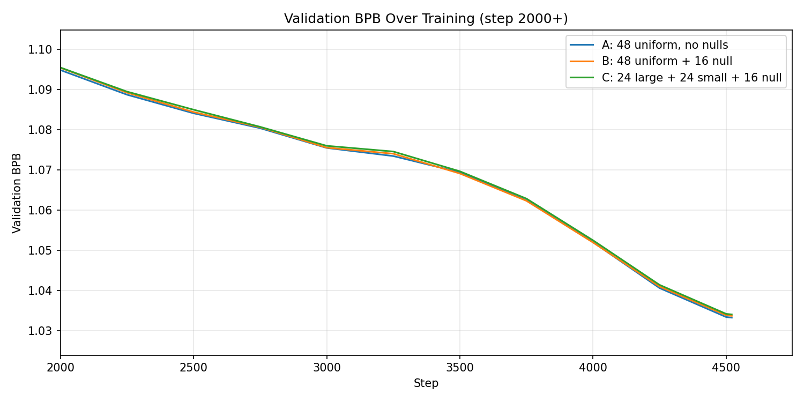
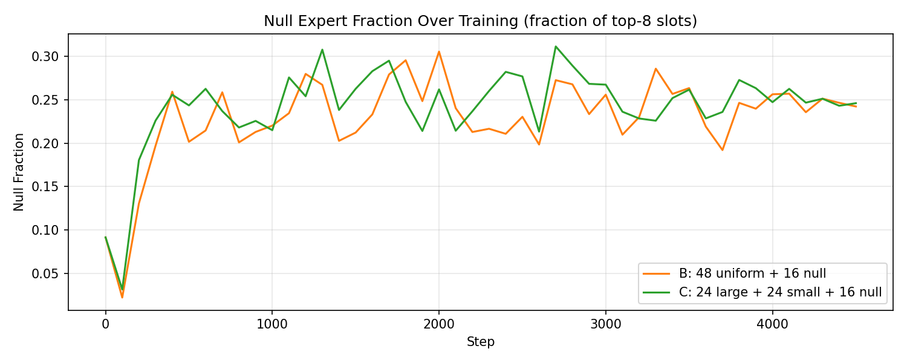
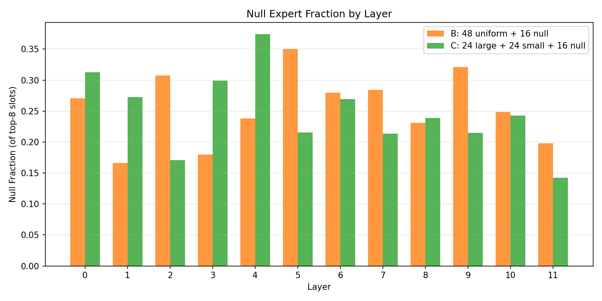
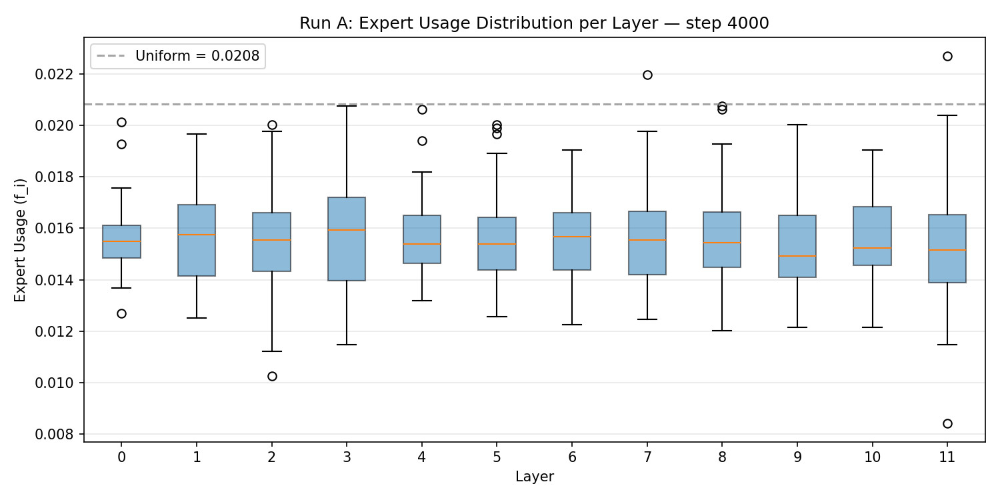
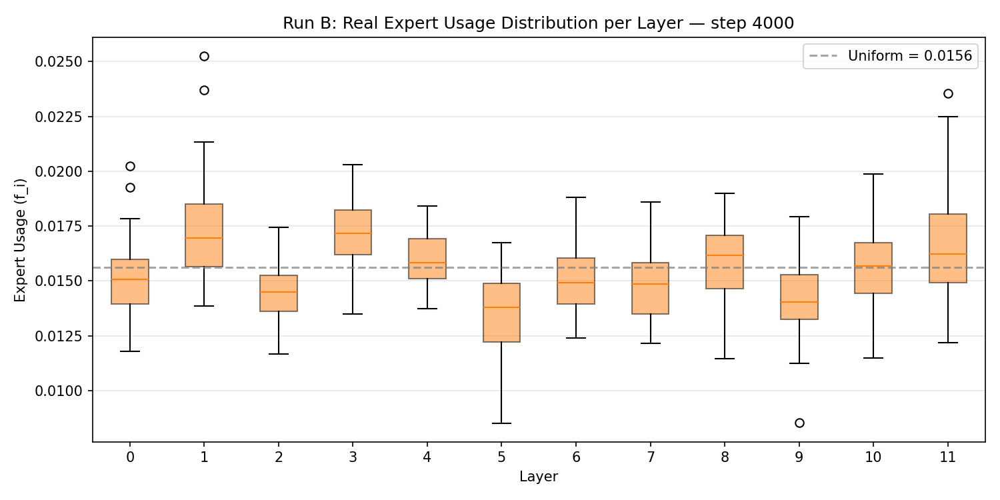
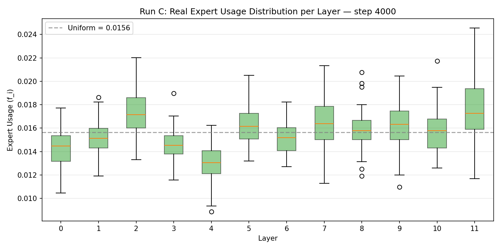
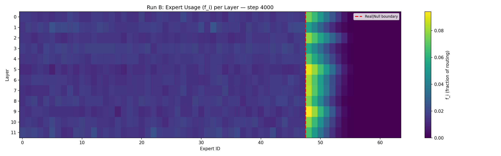
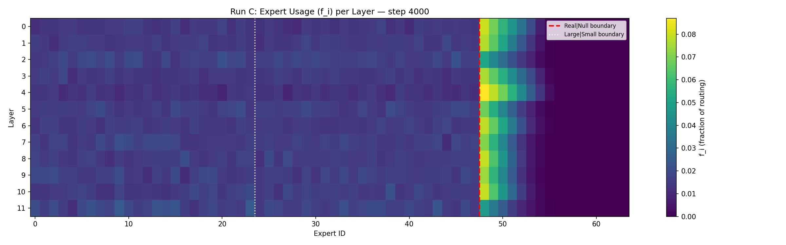
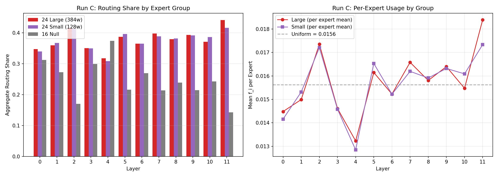

# MoE Null + Variable Expert Routing Analysis

## Experiment Setup

| Run | Config | Experts | Null Experts | LBL Weight |
|-----|--------|---------|--------------|------------|
| A | Baseline | 48 × 256 FFN | 0 | 0.08 |
| B | Uniform + Null | 48 × 256 FFN | 16 | 0.20 |
| C | Variable + Null | 24 × 384 + 24 × 128 FFN | 16 | 0.20 |

All models: 125M params, 12 layers, sigmoid routing, top-8 selection, ~4500 steps on OpenWebText.
Null experts use a single shared logit expanded to 16 copies; tokens routed to null get zero compute.

---
## 1. Training Curves

## 2. Final Metrics

| Run | Final val/BPB | Total Time (s) | Null Fraction | Real Experts/Token |
|-----|--------------|-----------------|---------------|-------------------|
| A | 1.0332 | 61196 | N/A | N/A (8.00) |
| B | 1.0337 | 60094 | 0.2422 | 6.06 |
| C | 1.0340 | 59526 | 0.2460 | 6.03 |

- **Run B** zero-compute token fraction (all 8 slots null): 0.002783
- **Run C** zero-compute token fraction (all 8 slots null): 0.003540

---
## 3. Null Expert Usage

### 3.1 Null Fraction Over Training

### 3.2 Null Fraction by Layer

**Run B** — null fraction per layer (step 4000):

| Layer | Null Fraction |
|-------|--------------|
| 0 | 0.2704 |
| 1 | 0.1664 |
| 2 | 0.3075 |
| 3 | 0.1798 |
| 4 | 0.2380 |
| 5 | 0.3501 |
| 6 | 0.2795 |
| 7 | 0.2843 |
| 8 | 0.2312 |
| 9 | 0.3213 |
| 10 | 0.2487 |
| 11 | 0.1982 |

**Run C** — null fraction per layer (step 4000):

| Layer | Null Fraction |
|-------|--------------|
| 0 | 0.3127 |
| 1 | 0.2727 |
| 2 | 0.1705 |
| 3 | 0.2994 |
| 4 | 0.3743 |
| 5 | 0.2157 |
| 6 | 0.2693 |
| 7 | 0.2134 |
| 8 | 0.2388 |
| 9 | 0.2148 |
| 10 | 0.2425 |
| 11 | 0.1423 |

---
## 4. Expert Usage Distribution

### Run A: A: 48 uniform, no nulls

Per-layer statistics for 48 real experts (step 4000):

| Layer | Min | Max | Mean | Std | Dead (<10% uniform) |
|-------|------|------|-------|------|---------------------|
| 0 | 0.01270 | 0.02014 | 0.01562 | 0.00130 | 0 |
| 1 | 0.01251 | 0.01965 | 0.01575 | 0.00166 | 0 |
| 2 | 0.01025 | 0.02002 | 0.01552 | 0.00219 | 0 |
| 3 | 0.01147 | 0.02075 | 0.01561 | 0.00210 | 0 |
| 4 | 0.01318 | 0.02063 | 0.01570 | 0.00154 | 0 |
| 5 | 0.01257 | 0.02002 | 0.01561 | 0.00178 | 0 |
| 6 | 0.01227 | 0.01904 | 0.01567 | 0.00158 | 0 |
| 7 | 0.01245 | 0.02197 | 0.01569 | 0.00189 | 0 |
| 8 | 0.01202 | 0.02075 | 0.01560 | 0.00201 | 0 |
| 9 | 0.01215 | 0.02002 | 0.01540 | 0.00183 | 0 |
| 10 | 0.01215 | 0.01904 | 0.01553 | 0.00158 | 0 |
| 11 | 0.00842 | 0.02271 | 0.01519 | 0.00230 | 0 |

Total dead experts across all layers: 0

### Run B: B: 48 uniform + 16 null

Per-layer statistics for 48 real experts (step 4000):

| Layer | Min | Max | Mean | Std | Dead (<10% uniform) |
|-------|------|------|-------|------|---------------------|
| 0 | 0.01178 | 0.02025 | 0.01520 | 0.00168 | 0 |
| 1 | 0.01385 | 0.02527 | 0.01737 | 0.00252 | 0 |
| 2 | 0.01166 | 0.01744 | 0.01443 | 0.00129 | 0 |
| 3 | 0.01349 | 0.02031 | 0.01709 | 0.00149 | 0 |
| 4 | 0.01375 | 0.01841 | 0.01587 | 0.00114 | 0 |
| 5 | 0.00851 | 0.01676 | 0.01354 | 0.00167 | 0 |
| 6 | 0.01239 | 0.01881 | 0.01501 | 0.00142 | 0 |
| 7 | 0.01215 | 0.01859 | 0.01491 | 0.00163 | 0 |
| 8 | 0.01146 | 0.01898 | 0.01602 | 0.00173 | 0 |
| 9 | 0.00853 | 0.01793 | 0.01414 | 0.00166 | 0 |
| 10 | 0.01147 | 0.01986 | 0.01565 | 0.00182 | 0 |
| 11 | 0.01219 | 0.02356 | 0.01670 | 0.00268 | 0 |

Total dead experts across all layers: 0

### Run C: C: 24 large + 24 small + 16 null

Per-layer statistics for 48 real experts (step 4000):

| Layer | Min | Max | Mean | Std | Dead (<10% uniform) |
|-------|------|------|-------|------|---------------------|
| 0 | 0.01046 | 0.01772 | 0.01432 | 0.00159 | 0 |
| 1 | 0.01190 | 0.01862 | 0.01515 | 0.00139 | 0 |
| 2 | 0.01331 | 0.02202 | 0.01728 | 0.00203 | 0 |
| 3 | 0.01156 | 0.01898 | 0.01460 | 0.00146 | 0 |
| 4 | 0.00886 | 0.01625 | 0.01304 | 0.00152 | 0 |
| 5 | 0.01318 | 0.02051 | 0.01634 | 0.00177 | 0 |
| 6 | 0.01271 | 0.01823 | 0.01522 | 0.00134 | 0 |
| 7 | 0.01129 | 0.02133 | 0.01639 | 0.00191 | 0 |
| 8 | 0.01191 | 0.02078 | 0.01586 | 0.00171 | 0 |
| 9 | 0.01096 | 0.02045 | 0.01636 | 0.00208 | 0 |
| 10 | 0.01260 | 0.02173 | 0.01578 | 0.00199 | 0 |
| 11 | 0.01169 | 0.02456 | 0.01787 | 0.00282 | 0 |

Total dead experts across all layers: 0

---
## 5. Expert Usage Heatmaps

### Run B

Red dashed line = real/null boundary.

### Run C

Red dashed line = real/null boundary.
 White dotted line = large/small boundary.

---
## 6. Run C: Expert Size Group Analysis

### Aggregate Routing Share per Layer

| Layer | Large (24×384) | Small (24×128) | Null (16) |
|-------|----------------|----------------|-----------|
| 0 | 0.3475 | 0.3398 | 0.3127 |
| 1 | 0.3598 | 0.3675 | 0.2727 |
| 2 | 0.4165 | 0.4130 | 0.1705 |
| 3 | 0.3507 | 0.3499 | 0.2994 |
| 4 | 0.3174 | 0.3083 | 0.3743 |
| 5 | 0.3875 | 0.3968 | 0.2157 |
| 6 | 0.3654 | 0.3653 | 0.2693 |
| 7 | 0.3979 | 0.3887 | 0.2134 |
| 8 | 0.3793 | 0.3819 | 0.2388 |
| 9 | 0.3935 | 0.3917 | 0.2148 |
| 10 | 0.3714 | 0.3861 | 0.2425 |
| 11 | 0.4416 | 0.4161 | 0.1423 |

### Per-Expert Mean by Group

| Layer | Large Mean f_i | Small Mean f_i | Ratio (Large/Small) |
|-------|---------------|---------------|---------------------|
| 0 | 0.01448 | 0.01416 | 1.02× |
| 1 | 0.01499 | 0.01531 | 0.98× |
| 2 | 0.01736 | 0.01721 | 1.01× |
| 3 | 0.01461 | 0.01458 | 1.00× |
| 4 | 0.01323 | 0.01284 | 1.03× |
| 5 | 0.01615 | 0.01653 | 0.98× |
| 6 | 0.01523 | 0.01522 | 1.00× |
| 7 | 0.01658 | 0.01620 | 1.02× |
| 8 | 0.01581 | 0.01591 | 0.99× |
| 9 | 0.01640 | 0.01632 | 1.00× |
| 10 | 0.01547 | 0.01609 | 0.96× |
| 11 | 0.01840 | 0.01734 | 1.06× |

---
## 7. Key Findings

*(auto-generated summary — review against plots)*

1. **Best val/BPB**: Run A (1.0332)
   - Run B: +0.0004 vs A
   - Run C: +0.0008 vs A

2. **Run B null usage**: ranges from 0.1664 (layer 1) to 0.3501 (layer 5). Mean = 0.2563
2. **Run C null usage**: ranges from 0.1423 (layer 11) to 0.3743 (layer 4). Mean = 0.2472

3. **Run A dead experts**: 0 total across all layers (threshold: <10% of uniform)
3. **Run B dead experts**: 0 total across all layers (threshold: <10% of uniform)
3. **Run C dead experts**: 0 total across all layers (threshold: <10% of uniform)

4. **Run C size preference**: Large experts get 1.01× more routing than small experts on average (per expert). Large mean f_i = 0.01572, Small mean f_i = 0.01564
